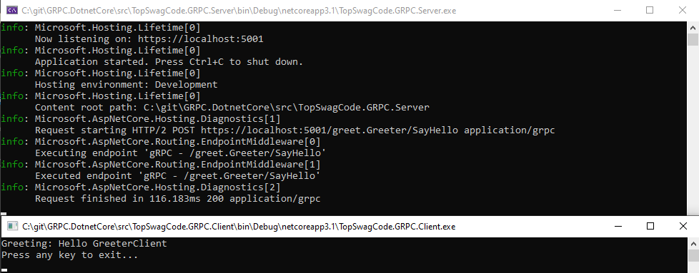

# GRPC.DotnetCore


## Overview

gRPC is an open source remote procedure call (RPC) system initially developed at Google in 2015. gRPC does not! stand for Google Remote Procedure Call, but "gRPC Remote Procedure Calls". Below I have quoted their own page to give a small overview of what it is.

> In gRPC, a client application can directly call a method on a server application on a different machine as if it were a local object, making it easier for you to create distributed applications and services. As in many RPC systems, gRPC is based around the idea of defining a service, specifying the methods that can be called remotely with their parameters and return types. On the server side, the server implements this interface and runs a gRPC server to handle client calls. On the client side, the client has a stub (referred to as just a client in some languages) that provides the same methods as the server.
> 
> gRPC clients and servers can run and talk to each other in a variety of environments - from servers inside Google to your own desktop - and can be written in any of gRPC’s supported languages. So, for example, you can easily create a gRPC server in Java with clients in Go, Python, or Ruby. In addition, the latest Google APIs will have gRPC versions of their interfaces, letting you easily build Google functionality into your applications.

Quotes taken from [gRPC.io](https://grpc.io/docs/guides/)

I won't spend any time describing the performance of gRPC. There is an awesome blog post by Auth0 that can be read [here.](https://auth0.com/blog/beating-json-performance-with-protobuf/)

## Working with gRPC in Dotnet Core.

### Server

We can start by using the default gRPC template that dotnet provides us.


Creating a new project using the template we can find a .proto file that looks like this describing the message format.

```proto
    syntax = "proto3";

    option csharp_namespace = "TopSwagCode.GRPC.Server";

    package greet;

    // The greeting service definition.
    service Greeter {
    // Sends a greeting
    rpc SayHello (HelloRequest) returns (HelloReply);
    }

    // The request message containing the user's name.
    message HelloRequest {
    string name = 1;
    }

    // The response message containing the greetings.
    message HelloReply {
    string message = 1;
    }

```

If we look inside the csproj file, we can see the proto file is included as a protobuf gRPC Service running on a server. This will generate code for us to easily implement a service.

```xml
    <ItemGroup>
    <Protobuf Include="Protos\greet.proto" GrpcServices="Server" />
    </ItemGroup>
```

We can take a look at the code generated. Small part can be seen in the screenshot below.


Now we can check out the implementation of the service logic that uses the generated code.

```csharp
    public class GreeterService : Greeter.GreeterBase
    {
        private readonly ILogger<GreeterService> _logger;
        public GreeterService(ILogger<GreeterService> logger)
        {
            _logger = logger;
        }

        public override Task<HelloReply> SayHello(HelloRequest request, ServerCallContext context)
        {
            return Task.FromResult(new HelloReply
            {
                Message = "Hello " + request.Name
            });
        }
    }
```

Last thing to check out is how routing is handled. You can find this in Startup.cs and it looks similar to how normal API's are set up.

```csharp
    public class Startup
    {
        // This method gets called by the runtime. Use this method to add services to the container.
        // For more information on how to configure your application, visit https://go.microsoft.com/fwlink/?LinkID=398940
        public void ConfigureServices(IServiceCollection services)
        {
            services.AddGrpc();
        }

        // This method gets called by the runtime. Use this method to configure the HTTP request pipeline.
        public void Configure(IApplicationBuilder app, IWebHostEnvironment env)
        {
            if (env.IsDevelopment())
            {
                app.UseDeveloperExceptionPage();
            }

            app.UseRouting();

            app.UseEndpoints(endpoints =>
            {
                endpoints.MapGrpcService<GreeterService>();

                endpoints.MapGet("/", async context =>
                {
                    await context.Response.WriteAsync("Communication with gRPC endpoints must be made through a gRPC client. To learn how to create a client, visit: https://go.microsoft.com/fwlink/?linkid=2086909");
                });
            });
        }
    }
```

### Client

Well doesn't make much sense to create a gRPC server without also showing how to interact with it. We can start by creating a simple Console app.


Start by adding a new folder called Protos like the one we had on the server side. And copy the file over. This time you should go in and edit the csproj file and add an ItemGroup as shown below. This time instead of being an gRPC server, it's a client.

```proto
  <ItemGroup>
    <Protobuf Include="Protos\greet.proto" GrpcServices="Client" />
  </ItemGroup>
```

Then install the following nuget packages to support gRPC:

* Google.Protobuf
* Grpc.Net.Client
* Grpc.Tools

Then build the code. This will generate a bunch of boilerplate client code that you don't have to think about and simply use. With this done you can create a simple client call to our server. Let's do that by opening the Program.cs and use the auto generated client.

```csharp
using Grpc.Net.Client;
using System;
using System.Threading.Tasks;
using TopSwagCode.GRPC.Server;
using static TopSwagCode.GRPC.Server.Greeter;

namespace TopSwagCode.GRPC.Client
{
    class Program
    {
        static async Task Main(string[] args)
        {
            // The port number(5001) must match the port of the gRPC server.
            using var channel = GrpcChannel.ForAddress("https://localhost:5001");

            await GreeterRequest(channel);
        }

        private static async Task GreeterRequest(GrpcChannel channel)
        {
            var client = new GreeterClient(channel);
            var reply = await client.SayHelloAsync(
                                new HelloRequest { Name = "GreeterClient" });
            Console.WriteLine("Greeting: " + reply.Message);
            Console.WriteLine("Press any key to exit...");

            Console.ReadKey();
        }
    }
}

```

Running client and server should result in something like the following



## Advanced

So far I have described the "simple" hello world example. But gRPC has so much more to offer like: 

### Server streaming RPC

>A server-streaming RPC is similar to a unary RPC, except that the server returns a stream of messages in response to a client’s request. After sending all its messages, the server’s status details (status code and optional status message) and optional trailing metadata are sent to the client. This completes processing on the server side. The client completes once it has all the server’s messages.

### Client streaming RPC

>A client-streaming RPC is similar to a unary RPC, except that the client sends a stream of messages to the server instead of a single message. The server responds with a single message (along with its status details and optional trailing metadata), typically but not necessarily after it has received all the client’s messages.

### Bidirectional streaming RPC

>In a bidirectional streaming RPC, the call is initiated by the client invoking the method and the server receiving the client metadata, method name, and deadline. The server can choose to send back its initial metadata or wait for the client to start streaming messages.
>
>Client- and server-side stream processing is application specific. Since the two streams are independent, the client and server can read and write messages in any order. For example, a server can wait until it has received all of a client’s messages before writing its messages, or the server and client can play “ping-pong” – the server gets a request, then sends back a response, then the client sends another request based on the response, and so on.

### Example Streaming Weather forecasts server

In this repository I am showing how Server streaming RPC works. I have implemented a simple WeatherForecasts demo that shows a stream of weather forecasts from server to client. Starting with server code first. I will create a new .proto file in the Protos folder. The file will be named `weather.proto`, that looks like the this:

```proto
syntax = "proto3";

import "google/protobuf/empty.proto";
import "google/protobuf/timestamp.proto";

option csharp_namespace = "TopSwagCode.GRPC.Server";
package WeatherForecast;

service WeatherForecasts {
rpc GetWeatherStream (google.protobuf.Empty) returns (stream WeatherData);
}

message WeatherData {
google.protobuf.Timestamp dateTimeStamp = 1;
int32 temperatureC = 2;
int32 temperatureF = 3;
string summary = 4;
}
```

Afterwards we need to remember editing the csproj file to include the proto file, like the greet.proto.

```xml
  <ItemGroup>
    <Protobuf Include="Protos\weather.proto" GrpcServices="Server" />
    <Protobuf Include="Protos\greet.proto" GrpcServices="Server" />
  </ItemGroup>
```

This will enable the auto generation of server code, which will help us creating the Weather service. Create WeatherForecastService.cs and implementing the generated code will look something like this:

```csharp
    public class WeatherForecastService : WeatherForecasts.WeatherForecastsBase
    {
        public override Task GetWeatherStream(Empty request, IServerStreamWriter<WeatherData> responseStream, ServerCallContext context)
        {
            return base.GetWeatherStream(request, responseStream, context);
        }
    }
```

Now it is up to us to implement the logic for the gRPC service to return a response stream. I borrow the logic that exists in the Api Template for AspNet Core for generating weather forecasts. Just instead of returning a list of weather forecasts, I will return them one by one as they are generated. This way the client could start working with the data as they drop in and don't have to wait for the entire response to be built before starting.

```csharp
using System;
using System.Threading.Tasks;
using Google.Protobuf.WellKnownTypes;
using Grpc.Core;
using Microsoft.Extensions.Logging;

namespace TopSwagCode.GRPC.Server
{

    public class WeatherForecastService : WeatherForecasts.WeatherForecastsBase
    {
        private static readonly string[] Summaries = new[]
        {
            "Freezing", "Bracing", "Chilly", "Cool", "Mild", "Warm", "Balmy", "Hot", "Sweltering", "Scorching"
        };

        private readonly ILogger<WeatherForecastService> _logger;
        public WeatherForecastService(ILogger<WeatherForecastService> logger)
        {
            _logger = logger;
        }

        public override async Task GetWeatherStream(Empty request, IServerStreamWriter<WeatherData> responseStream, ServerCallContext context)
        {
            var rng = new Random();
            var now = DateTime.UtcNow;

            var i = 0;
            while (!context.CancellationToken.IsCancellationRequested && i < 20)
            {
                await Task.Delay(500); // Gotta look busy

                var forecast = new WeatherData
                {
                    DateTimeStamp = Timestamp.FromDateTime(now.AddDays(i++)),
                    TemperatureC = rng.Next(-20, 55),
                    Summary = Summaries[rng.Next(Summaries.Length)]
                };

                _logger.LogInformation("Sending WeatherData response");

                if (!context.CancellationToken.IsCancellationRequested) // Extra guard. Cancellation might have been done while work was been done.
                {
                    await responseStream.WriteAsync(forecast);
                }
                else
                {
                    _logger.LogWarning("Stream has been cancelled by the client.");
                }
                
            }
        }
    }

}
```

In this example you can see the service is always trying to reply with 20 weather forecasts unless the client has cancelled the request. I have put 2 guards up to ensure we don't do any work if the client doesn't accept any new responses. One before we start doing any work and one just when we are about to send the response. The client might have cancelled in those ~500ms we were getting those weather forecasts. Only thing to note here is how to return an element to the response stream is: `await responseStream.WriteAsync(forecast);`

Only one thing left now and that is the route mapping for the weather forecasts service. This is done in startup, just like greet service does it.

```csharp
    app.UseEndpoints(endpoints =>
    {
        endpoints.MapGrpcService<GreeterService>();
        endpoints.MapGrpcService<WeatherForecastService>();

        endpoints.MapGet("/", async context =>
        {
            await context.Response.WriteAsync("Communication with gRPC endpoints must be made through a gRPC client. To learn how to create a client, visit: https://go.microsoft.com/fwlink/?linkid=2086909");
        });
    });
```

### Example Streaming Weather forecasts client

We have more or less been through how to implement a new client, as we did it for greet.proto.

* We copy over the weather.proto file.
* We edit the csproj for the weather.proto file.
* We build the solution to get auto generated code.
* We use the auto generated client to call the server.

Only thing different from greet now is we are receiving a stream of data instead of a single result. This will let us play around with a "new" c# 8 feature [Async Enumerables](https://docs.microsoft.com/en-us/archive/msdn-magazine/2019/november/csharp-iterating-with-async-enumerables-in-csharp-8).

```csharp
using Google.Protobuf.WellKnownTypes;
using Grpc.Core;
using Grpc.Net.Client;
using System;
using System.IO;
using System.Threading;
using System.Threading.Tasks;
using TopSwagCode.GRPC.Server;
using static TopSwagCode.GRPC.Server.Greeter;
using static WeatherForecast.WeatherForecasts;

namespace TopSwagCode.GRPC.Client
{
    class Program
    {
        static async Task Main(string[] args)
        {
            // The port number(5001) must match the port of the gRPC server.
            using var channel = GrpcChannel.ForAddress("https://localhost:5001");

            await GreeterRequest(channel);
            await WeatherForecastsRequest(channel);
        }

        private static async Task GreeterRequest(GrpcChannel channel)
        {
            var client = new GreeterClient(channel);
            var reply = await client.SayHelloAsync(
                                new HelloRequest { Name = "GreeterClient" });
            Console.WriteLine("Greeting: " + reply.Message);
            Console.WriteLine("Press any key to continue...");

            Console.ReadKey();
        }
        private static async Task WeatherForecastsRequest(GrpcChannel channel)
        {
            var client = new WeatherForecastsClient(channel);

            var cts = new CancellationTokenSource(TimeSpan.FromSeconds(2)); // If slower than 2 seconds. Stop request.
            var streamingCall = client.GetWeatherStream(new Empty(), cancellationToken: cts.Token);

            try
            {
                await foreach (var weatherData in streamingCall.ResponseStream.ReadAllAsync(cancellationToken: cts.Token))
                {
                    Console.WriteLine($"{weatherData.DateTimeStamp.ToDateTime():s} | {weatherData.Summary} | {weatherData.TemperatureC} C");
                }
            }
            catch (RpcException ex) when (ex.StatusCode == StatusCode.Cancelled)
            {
                Console.WriteLine("Stream cancelled.");
            }
            catch (IOException) // https://github.com/dotnet/runtime/issues/1586
            {
                Console.WriteLine("Client and server disagree on active stream count.");
            }

            Console.WriteLine("Press any key to exit...");
            Console.ReadKey();
        }
    }
}
```

In the above example we can see we create a client that gets as much data as possible in a 2 second timespan. If the server is not done in those 2 seconds we get an RpcException with StatusCode Cancelled. Sadly as of creating this repository there is an open issue on HTTP/2, that forces us to also catch IOException.

Running client and server should result in something like the following


I hope this has helped you get started with gRPC with Aspnet Core. Either if you are creating your own service or have to implement a client for an existing service.

Google has a set of services you can start to play with. 

* https://googleapis.github.io/HowToRPC.html
* https://github.com/googleapis/googleapis

Thats all folks. See you next time :)
